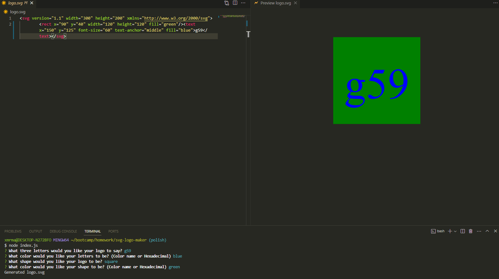

 # SVG Logo Maker

## Description

This app allows you to create your own customized logo where the user can select three letters, letter color, a shape, and shape color, which are then all turned into a SVG file. The node package "Inquirer" is used to prompt the user to select their choices. Then the default fs module writes these results to a logo.svg file. 

## Table of Contents

- [Installation](#installation)
- [Usage](#usage)
- [Credits](#credits)
- [License](#license)
- [Questions](#questions)

## Installation

Clone the repository. Run npm install within the console to install the correct dependencies required. Once that is done, you can run "node index.js" within the console to initiate the app. Additionally you can run npm test to make use of the jest package.

## Usage

For a walkthrough video on using the app, please visit this link! 

https://drive.google.com/file/d/1OOwEZ9D0srM1OCuQb35Psv3AlrsO--Fh/view?usp=sharing

## Credits

Special thanks to my class mate Tyler Peterson! While I did not get any code directly from Tyler, it was his idea to make a switch-case statement to properly get the users shape.

## License

This project is licensed under the MIT license. License link: https://opensource.org/license/mit/

## Questions

You can see below to reach me for any questions you have regarding the project.

https://github.com/rb2277

